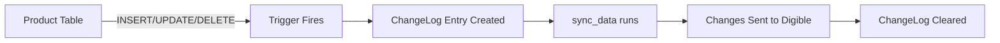

shopMaster uses SQL Server triggers to automatically track product changes. When products are inserted, updated, or deleted, triggers write change records to the ChangeLog table for later synchronization.

## create_change_log_and_triggers

Set up the ChangeLog table and all tracking triggers on your product table.

```python
from app.helper import create_change_log_and_triggers
import os
from dotenv import load_dotenv

load_dotenv()
db_url = os.getenv("local_db_url")

result = create_change_log_and_triggers(db_url)
if result == "Configuration Successful":
    print("Triggers are now active")
else:
    print(f"Setup failed: {result}")
```

<ParamField path="db_url" type="str" required>
  The SQLAlchemy database URL for your local SQL Server database
</ParamField>

<ResponseField name="result" type="str">
  Returns "Configuration Successful" on success, or an error message string (e.g., "Error: Table does not exist") on failure
</ResponseField>

### What it creates

1. **ChangeLog table**: If it doesn't already exist (see [Models](/api/models#changelog-table) for schema)
2. **trgAfterInsert**: Tracks newly inserted products
3. **trgAfterUpdate**: Tracks product modifications
4. **trgAfterDelete**: Tracks product deletions

<Note>
  The function uses `CREATE OR ALTER TRIGGER`, so you can safely run it multiple times to update trigger logic without errors.
</Note>

## trgAfterInsert

Automatically logs new products to the ChangeLog table when they are inserted.

### Trigger logic

```sql
CREATE OR ALTER TRIGGER trgAfterInsert ON [YourProductTable]
AFTER INSERT
AS
BEGIN
    SET NOCOUNT ON;
    IF NOT EXISTS (
        SELECT * FROM ChangeLog 
        WHERE ChangeType = 'INSERT' 
        AND ProductID IN (SELECT ProductID FROM inserted)
    )
    BEGIN
        INSERT INTO ChangeLog (ChangeType, ProductID, ProductName, SellPrice, QrCode, Status)
        SELECT 'INSERT', i.ProductID, i.ProductName, i.SellPrice, i.QrCode, i.Status
        FROM inserted i;
    END
END;
```

### How it works

1. Fires after a product INSERT operation
2. Checks if an INSERT record already exists for this ProductID in ChangeLog
3. If not, creates a new ChangeLog entry with:
   - ChangeType: "INSERT"
   - Product data from the `inserted` pseudo-table
   - ChangeDateTime: Auto-set to GETDATE()

<Info>
  The duplicate check prevents the same INSERT from being logged multiple times if the trigger fires repeatedly.
</Info>

## trgAfterUpdate

Automatically logs product modifications to the ChangeLog table when they are updated.

### Trigger logic

```sql
CREATE OR ALTER TRIGGER trgAfterUpdate ON [YourProductTable]
AFTER UPDATE
AS
BEGIN
    SET NOCOUNT ON;
    IF NOT EXISTS (
        SELECT * FROM ChangeLog 
        WHERE ChangeType = 'UPDATE' 
        AND ProductID IN (SELECT ProductID FROM inserted)
    )
    BEGIN
        INSERT INTO ChangeLog (ChangeType, ProductID, ProductName, SellPrice, QrCode, Status)
        SELECT 'UPDATE', i.ProductID, i.ProductName, i.SellPrice, i.QrCode, i.Status
        FROM inserted i;
    END
END;
```

### How it works

1. Fires after a product UPDATE operation
2. Checks if an UPDATE record already exists for this ProductID in ChangeLog
3. If not, creates a new ChangeLog entry with the updated product data

<Note>
  The trigger captures the **new** values from the `inserted` pseudo-table, not the old values. This is what gets synced to the cloud.
</Note>

## trgAfterDelete

Automatically logs product deletions to the ChangeLog table when they are removed.

### Trigger logic

```sql
CREATE OR ALTER TRIGGER trgAfterDelete ON [YourProductTable]
AFTER DELETE
AS
BEGIN
    SET NOCOUNT ON;
    IF NOT EXISTS (
        SELECT * FROM ChangeLog 
        WHERE ChangeType = 'DELETE' 
        AND ProductID IN (SELECT ProductID FROM deleted)
    )
    BEGIN
        INSERT INTO ChangeLog (ChangeType, ProductID, ProductName, SellPrice, QrCode, Status)
        SELECT 'DELETE', d.ProductID, d.ProductName, d.SellPrice, d.QrCode, d.Status
        FROM deleted d;
    END
END;
```

### How it works

1. Fires after a product DELETE operation
2. Checks if a DELETE record already exists for this ProductID in ChangeLog
3. If not, creates a new ChangeLog entry with data from the `deleted` pseudo-table

<Warning>
  While DELETE operations are logged, the `sync_data()` function only processes INSERT and UPDATE records. Deletions are tracked but not currently synced to the Digible platform.
</Warning>

## Synchronization workflow

The triggers enable automatic background sync:



1. Your POS or inventory system modifies products in the local table
2. SQL Server triggers automatically log changes to ChangeLog
3. shopMaster's sync process reads ChangeLog periodically
4. Changes are uploaded to Digible via API
5. Successfully synced records are deleted from ChangeLog

<Tip>
  You can manually inspect pending changes by querying: `SELECT * FROM ChangeLog`
</Tip>
